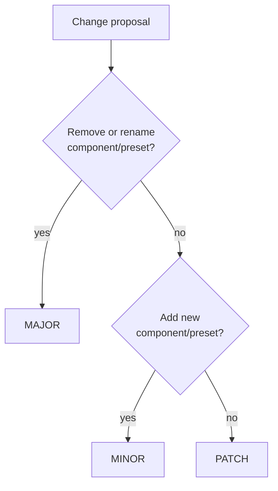

# Contributing to Library Interfaces

Thank you for your interest in contributing to the Library Interfaces registry! This document outlines the process for proposing, refining, and maintaining interfaces.

## Core Principles

Before contributing, please understand these guiding principles:

1. **Semantic Focus** - Components and presets must represent content purpose, not visual presentation
2. **Domain Specificity** - Interfaces should target specific content domains with clear boundaries
3. **Implementation Freedom** - Interfaces define what components mean, not how they look
4. **Content Portability** - The goal is markdown that works across multiple libraries
5. **Practical Utility** - Interfaces should solve real-world content challenges

## Types of Contributions

### 1. New Interface Drafts

Creating a new interface for a domain not yet covered (e.g., portfolio, education).

### 2. Improvements to Existing Interfaces

Enhancing existing interfaces with new components or presets (minor versions).

### 3. Major Version Proposals

Significant rethinking of an interface with breaking changes.

### 4. Extension Registration

Adding pointers to organization-specific interface extensions.

### 5. Documentation and Examples

Improving explanations or adding reference implementations.

## Contribution Process

### Step 1: Research & Planning

Before creating a new interface:

1. **Research the domain** - Understand common content patterns and needs
2. **Review existing interfaces** - Look for potential overlap or extension opportunities
3. **Gather examples** - Collect real-world examples of the content types you're targeting
4. **Consider user needs** - Focus on content creators' perspective first
5. **Outline key components** - Identify the core semantic building blocks

### Step 2: Draft Development

For new interfaces:

1. Fork the repository
2. Create your interface following the repository structure:

   ```
   /drafts/
     /[domain]/
       /0.1.0/
         /[concept]/
           [domain]-[concept].js
   ```

3. Follow the standard interface format:

```js
export default {
  description: "Clear description of domain purpose",
  category: "domain-category", // Matches the domain name
  version: "0.1.0",
  components: {
    ComponentName: {
      description: "What this component represents",
      category: "Component Category",
      presets: {
        preset1: "Brief explanation of purpose",
        preset2: "Brief explanation of purpose",
      },
    },
    // Additional components...
  },
};
```

4. Ensure your interface passes validation:

```bash
npm run validate-interface ./drafts/[domain]/0.1.0/[concept]/[domain]-[concept].js
```

5. Create a README.md in your PR explaining:
   - The domain's purpose
   - Target content creators
   - Rationale for component selection
   - Example content scenarios

### Step 3: Community Review

1. Open a Pull Request to the main repository
2. Request feedback from both:
   - Content creators in the domain
   - Developers with implementation experience
3. Be prepared to iterate based on feedback
4. Address questions about:
   - Component scope and boundaries
   - Semantic clarity of names
   - Preset completeness
   - Real-world applicability

### Step 4: Refinement

Interfaces typically go through several iterations before stabilization:

1. v0.1 - Initial proposal
2. v0.2, v0.3, etc. - Refinements based on feedback
3. v0.9 - Release candidate for final review
4. v1.0 - Stable release

Each iteration should include change notes explaining the rationale.

### Step 5: Promotion to Stable

When an interface is ready for stable status:

1. Ensure it has received at least 3 approvals from community members
2. Have at least one reference implementation (even if minimal)
3. Complete all documentation
4. Move from `drafts/` to `interfaces/[domain]/1.0.0/[concept]/` directory
5. Update version to 1.0.0
6. Create a CHANGELOG.md file
7. Tag the release

## Versioning Guidelines

### Semantic Versioning

We follow strict semantic versioning:

- **MAJOR** (x.0.0) - Breaking changes that require content updates
- **MINOR** (0.x.0) - New components or presets (backward compatible)
- **PATCH** (0.0.x) - Documentation improvements, typo fixes

### Version Bump Cheat Sheet



### Rules for Version Changes

#### For Minor Versions (non-breaking):

- You may **add** new components
- You may **add** new presets to existing components
- You **must not** remove or rename any existing components or presets
- You **must not** change the semantic meaning of existing components or presets

Example acceptable changes for `marketing-v1.1`:

- Adding a new `PricingComparison` component
- Adding a new `interactive` preset to an existing component

#### For Major Versions (breaking):

- You may rename components to better reflect their purpose
- You may remove components that proved problematic
- You may restructure component hierarchy
- You must provide clear migration documentation
- You should have compelling reasons for breaking changes

## Writing Quality Interfaces

### Component Naming Playbook

| Guideline        | 👍 Good                                   | 🚫 Bad          |
| ---------------- | ----------------------------------------- | --------------- |
| Semantic nouns   | `FAQ`                                     | `FAQAccordion`  |
| Preset as intent | `deck`                                    | `three-up`      |
| Avoid geometry   | `Hero`                                    | `TwoColumnHero` |
| Domain‑scoped    | `ProductCarousel` in commerce, not global | —               |

**Mnemonic:** describe **what** it is, not **how** it looks.

For complete naming guidelines, see [NAMING_CONVENTIONS.md](./NAMING_CONVENTIONS.md).

### Documentation

Every interface should include:

1. **Component purpose** - What each component semantically represents
2. **Preset meanings** - The content variation each preset represents
3. **Content examples** - Sample markdown showing typical usage
4. **Implementation notes** - Guidance for developers (optional)

## Creating Extensions

For organization-specific extensions:

1. Host your interface in your own repository
2. Follow the same structure as the main repository
3. Use a naming pattern: `[org]-[domain]-v[version]`
4. Create a pointer file in the main repository's `extensions/` directory

Example pointer file (`extensions/acme-marketing-v1.0.json`):

```json
{
  "name": "acme-marketing",
  "version": "1.0.0",
  "description": "ACME Corp's enhanced marketing interface",
  "repository": "https://github.com/acme/interfaces",
  "path": "/marketing/acme-marketing-v1.0.js",
  "extends": ["marketing/1.0.0/core"]
}
```

## PR Quality Checklist

Before submitting your PR, ensure:

- [ ] Interface validates against schema
- [ ] Component names are semantic and follow naming conventions
- [ ] Presets clearly represent content variations
- [ ] Descriptions are clear and helpful
- [ ] Version number follows semantic versioning rules
- [ ] Documentation is complete and accurate
- [ ] CHANGELOG.md is updated (for existing interfaces)
- [ ] Examples demonstrate practical usage
- [ ] No implementation details are embedded in the interface

## Development Scripts

The repository includes helpful scripts:

```bash
# Validate your interface against the schema
npm run validate-interface ./path/to/your-interface.js

# Generate index.json (maintainers only)
npm run build-index

# Create interface scaffold
npm run create-interface -- --name=domain --version=0.1
```

## Questions?

If you have questions about the contribution process, please:

1. Check existing discussions in the issue tracker
2. Open a new issue with the "question" label
3. Ask in the community forum

We welcome contributions from both content creators and developers to ensure interfaces strike the right balance between semantic clarity and implementation flexibility.

## See Also

- [GLOSSARY.md](./GLOSSARY.md) - Definitions of key terms
- [REPOSITORY_STRUCTURE.md](./REPOSITORY_STRUCTURE.md) - How interfaces are organized
- [GOVERNANCE.md](./GOVERNANCE.md) - Governance process
- [VERSION_STRATEGY.md](./docs/governance/VERSION_STRATEGY.md) - Versioning approach
