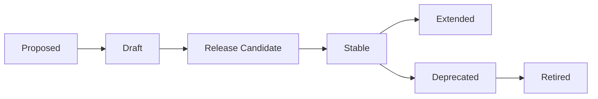

# Interface Lifecycle and Governance

This document outlines the lifecycle of Library Interfaces and the governance process that ensures their quality, utility, and sustainability. It combines and supersedes the previous `GOVERNANCE.md` and `interface-lifecycle.md` documents.

## Interface Lifecycle Stages

### 1. Proposed

- Initial concept submitted as an issue or discussion
- Outlines the domain, purpose, and key components
- Gathers initial feedback on necessity and scope
- Typically lasts 1-2 weeks

### 2. Draft

- Interface added to `drafts/` directory
- Version numbered as `0.x.y`
- Actively developed and refined
- No stability guarantees
- Typically evolves through several iterations
- Lasts until community consensus is reached

### 3. Release Candidate

- Final draft version (typically `0.9.x`)
- Considered feature complete
- Undergoes thorough review and validation
- At least one reference implementation required
- Documentation must be complete
- Lasts 2-4 weeks for final feedback

### 4. Stable

- Promoted to `interfaces/` directory
- Version numbered as `1.0.0`
- Considered complete and ready for production use
- Subject to semantic versioning rules
- May receive minor updates and improvements
- Typically remains active for years

### 5. Extended

- Receives significant new capabilities
- Version numbered as `1.x.0` (minor versions)
- Maintains backward compatibility
- Represents evolution within the same major version
- May continue receiving extensions for years

### 6. Deprecated

- Superseded by a newer major version
- Still available but no longer actively developed
- Clear migration path documented
- Typically enters this stage when a new major version is released
- Remains available for at least one year after deprecation

### 7. Retired

- Removed from active registry
- Archived but still accessible in repository history
- Only occurs after a lengthy deprecation period
- Extremely rare - our goal is long-term stability

## Governance Process

### Proposing a New Interface

1. **Open an issue** using the "Interface Proposal" template

   - Describe the domain and purpose
   - Outline key components and presets
   - Explain why a new interface is needed
   - Reference existing real-world examples

2. **Gather feedback** from the community (7-14 days)

   - Is this domain distinct enough to warrant a new interface?
   - Are there existing interfaces that could be extended instead?
   - Is there sufficient demand for standardization in this domain?

3. **Create initial draft** if feedback is positive
   - Create the interface file in `drafts/` directory following the structure in [REPOSITORY_STRUCTURE.md](./REPOSITORY_STRUCTURE.md)
   - Follow the standard interface format
   - Include thorough documentation
   - Submit as a Pull Request

### Evolving a Draft Interface

1. **Iterative development** through multiple draft versions

   - Incorporate community feedback
   - Refine component names and purposes
   - Adjust presets to cover common use cases
   - Document changes between draft versions

2. **Reference implementation**

   - At least one implementation should be developed
   - Tests the interface in real-world scenarios
   - Validates that the components and presets are practical
   - Doesn't need to be complete, but should cover core components

3. **Progress toward release candidate**
   - Update version to `0.9.0` when nearing completion
   - Final call for feedback
   - Complete all documentation
   - Ensure validation passes

### Promoting to Stable

1. **Final review** by core maintainers

   - At least 3 approvals required
   - Validation against schema must pass
   - Documentation must be complete
   - At least one reference implementation

2. **Promotion process**

   - Update version to `1.0.0`
   - Move from `drafts/` to proper location in `interfaces/`
   - Create CHANGELOG.md
   - Create tag/release
   - Update index.json

3. **Announcement**
   - Publish release notes
   - Notify community
   - Update documentation

### Managing Minor Updates

1. **Proposal for extension**

   - Open issue describing proposed additions
   - Explain rationale and use cases
   - Community feedback period (shorter than for new interfaces)

2. **Implementation and review**

   - Create new interface file with updated version following [VERSION_STRATEGY.md](./docs/governance/VERSION_STRATEGY.md)
   - Must follow rules for minor versions (backward compatible)
   - Review process similar to initial approval but faster

3. **Release process**
   - Update version to next minor version (`1.x.0`)
   - Keep previous version available
   - Update changelog
   - Create tag/release
   - Update index.json

### Major Version Updates

1. **RFC process**

   - Formal Request For Comments
   - Detailed proposal outlining breaking changes
   - Extended community discussion (2-4 weeks)
   - Must include migration strategy

2. **Development and validation**

   - Create new interface file with new major version
   - May be developed in `drafts/` first if changes are substantial
   - Reference implementation strongly recommended
   - Migration guide required

3. **Release process**
   - Update version to next major version (`x.0.0`)
   - Keep previous major version available
   - Mark previous version as deprecated in documentation
   - Create comprehensive changelog
   - Create tag/release
   - Update index.json

## Decision-Making Process

### Core Maintainers

- Group of 3-7 experienced community members
- Responsible for final approval of interfaces
- Ensure quality and consistency across interfaces
- Term limits and rotation to ensure fresh perspectives

### Community Input

- All interface development happens in the open
- Issues and PRs are primary discussion forums
- Feedback welcomed from both content creators and developers
- Domain experts are especially encouraged to participate

### Approval Requirements

For new stable interfaces:

- Minimum of 3 approvals from core maintainers
- No outstanding objections from community members
- At least one reference implementation
- Complete documentation
- Passing validation

For minor updates:

- Minimum of 2 approvals from core maintainers
- No outstanding objections from community members
- Passing validation

For major updates:

- Same requirements as new stable interfaces
- Must include migration guide
- Stronger justification for breaking changes

### Conflict Resolution

- Strive for consensus through discussion
- When consensus can't be reached:
  1. Clearly document different perspectives
  2. Core maintainers make final decision
  3. If still deadlocked, project lead has final say

## Extension Registry

### Purpose

The extension registry allows organizations to:

- Maintain specialized interfaces
- Build on core interfaces
- Establish domain-specific standards
- Remain discoverable through the CLI

### Registration Process

1. **Host interface** in external repository
2. **Create pointer file** in `extensions/` directory
3. **Submit PR** with pointer file
4. **Validation** to ensure pointer file is correct

### Extension Requirements

- Must follow same format as core interfaces
- Must specify which core interfaces it extends (if any)
- Must be publicly accessible
- Must include clear documentation
- No approval of the interface content itself (that's up to the maintaining organization)

## Practical Governance Examples

### Example 1: New Interface Proposal

**Step 1:** Issue opened proposing "portfolio-v0.1" interface

**Step 2:** Community discussion for 10 days

**Step 3:** Consensus reached that portfolio interface is valuable

**Step 4:** Initial draft created in `drafts/portfolio/0.1.0/core/portfolio-core.js`

**Step 5:** Several iterations based on feedback

**Step 6:** Reference implementation created

**Step 7:** Release candidate at `drafts/portfolio/0.9.0/core/portfolio-core.js`

**Step 8:** Final review period

**Step 9:** Promotion to `interfaces/portfolio/1.0.0/core/portfolio-core.js`

### Example 2: Minor Version Update

**Step 1:** Issue proposing new components for marketing interface

**Step 2:** Brief discussion period (1 week)

**Step 3:** New components implemented in `interfaces/marketing/1.1.0/` directory

**Step 4:** Review and approval

**Step 5:** Release of `marketing/1.1.0`

### Example 3: Major Version Update

**Step 1:** RFC for marketing-v2.0 with significant improvements

**Step 2:** Extended discussion (3 weeks)

**Step 3:** Draft of new major version in `drafts/marketing/2.0.0/` directory

**Step 4:** Reference implementation updated

**Step 5:** Migration guide written

**Step 6:** Final review and approval

**Step 7:** Release in `interfaces/marketing/2.0.0/` directory

**Step 8:** Previous version marked as deprecated but still available

## Governance Principles

1. **Transparency** - All decisions happen in the open
2. **Sustainability** - Careful consideration before accepting new interfaces
3. **Stability** - Strong preference for maintaining compatibility
4. **Practicality** - Interfaces must solve real-world problems
5. **Inclusivity** - Input welcome from all community members
6. **Quality** - High standards for naming, documentation, and semantics

By following these governance processes, we ensure that Library Interfaces remain:

- Focused on real needs
- Well-designed and consistent
- Stable over time
- Open to improvements
- Properly maintained

## See Also

- [GLOSSARY.md](./GLOSSARY.md) - Definitions of key terms
- [CONTRIBUTING.md](./CONTRIBUTING.md) - How to contribute
- [VERSION_STRATEGY.md](./docs/governance/VERSION_STRATEGY.md) - Versioning approach
