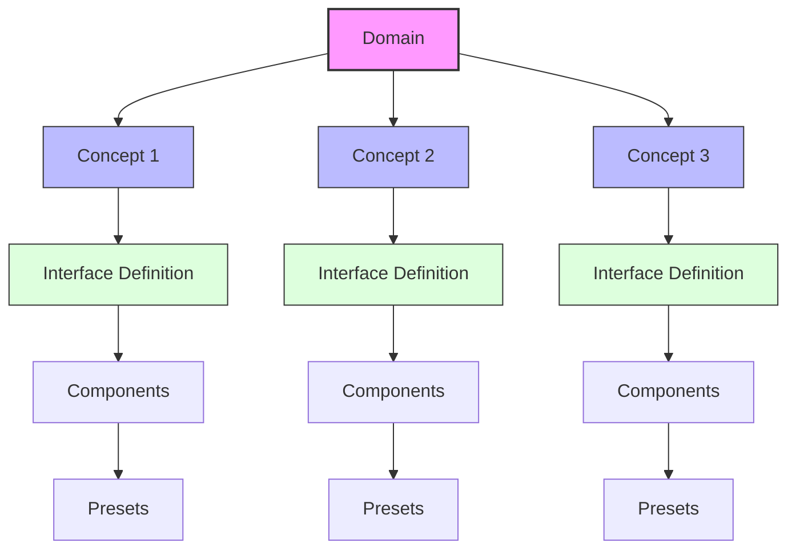
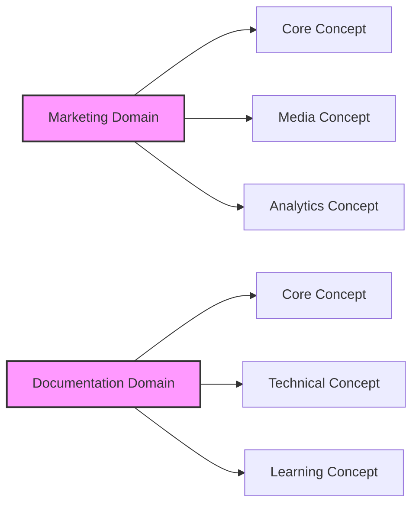
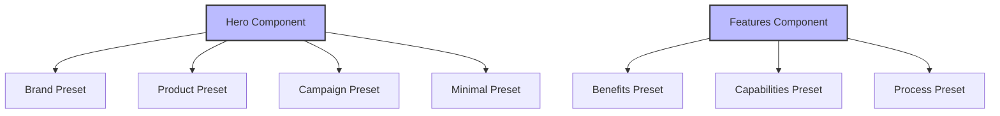
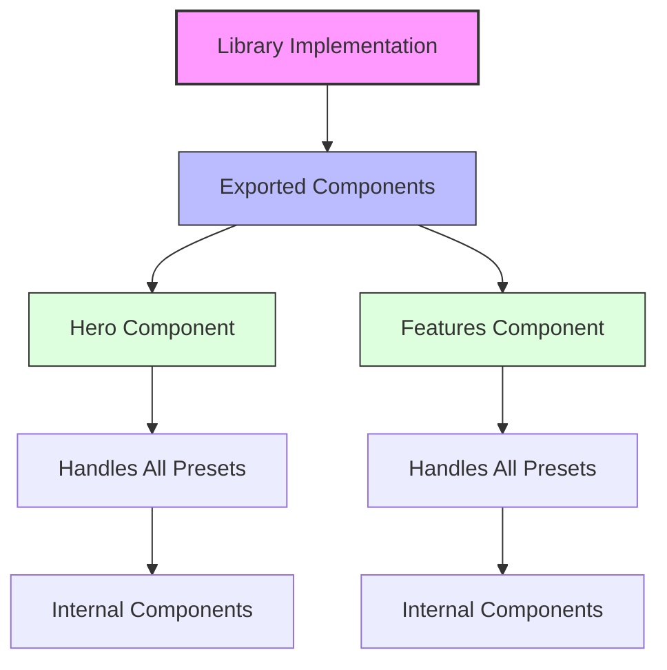
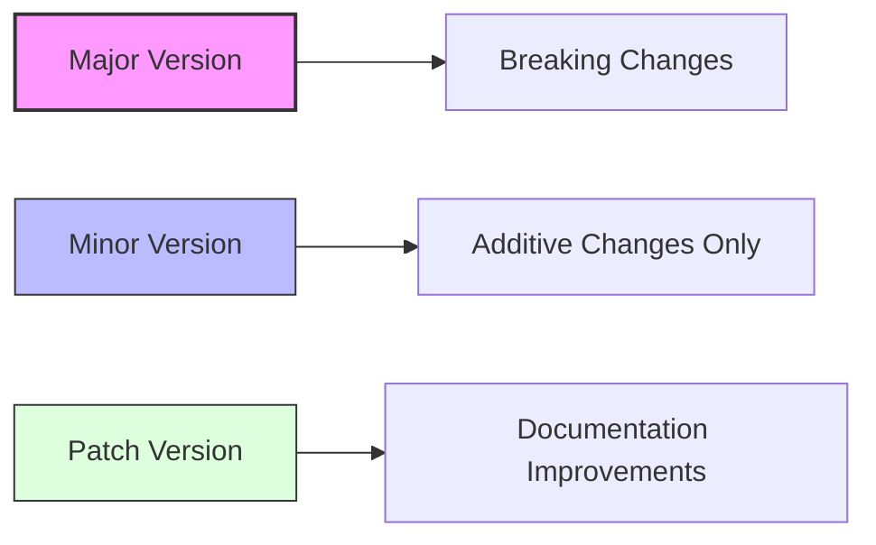

# Library Interfaces Architecture

This document provides a visual overview of the Library Interfaces standard structure and organization to help implementers understand the hierarchical relationships.

## Core Architecture

Library Interfaces are organized in a three-level hierarchy:



## Domain and Concept Relationship

Domains represent broad functional areas (like marketing, documentation, or ecommerce), while concepts represent specific functional capabilities within a domain.



## Component Structure

Each interface defines semantic components with presets:



## Repository Structure

The repository is organized to reflect this hierarchy:

```
interfaces/
├── domain/               # e.g., marketing, documentation
│   ├── version/          # e.g., 1.0.0, 1.1.0
│   │   ├── concept/      # e.g., core, media
│   │   │   └── domain-concept.js # Interface definition
```

## Implementation Pattern

When a library implements an interface, it follows this pattern:



## Version Compatibility

Version numbers follow semantic versioning rules:



## Content Structure

Components receive content in a standardized structure:

```json
{
  "main": {
    "title": "Main heading content",
    "paragraphs": ["First paragraph", "Second paragraph"],
    "images": [{ "src": "/image.jpg", "alt": "Image description" }],
    "links": [{ "text": "Link text", "url": "/target" }]
  },
  "items": [
    {
      "title": "First item heading",
      "paragraphs": ["Item content"],
      "images": [],
      "links": []
    }
  ]
}
```

## Key Principles

1. **Components represent content purpose**, not visual presentation
2. **Presets define content variations**, not visual styles
3. **Non-overlapping components** belong to exactly one concept
4. **Version compatibility** ensures content portability
