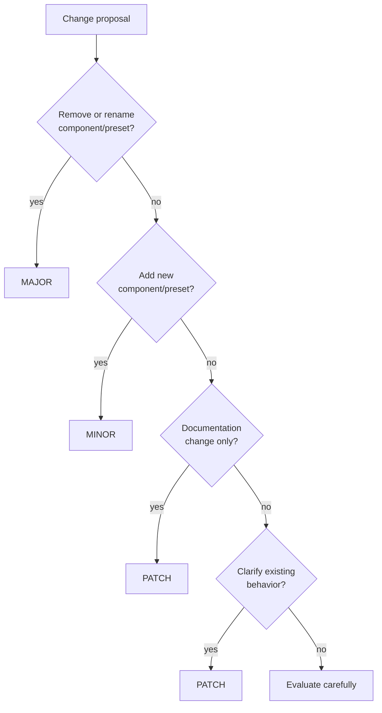

# Versioning Guidelines for Library Interfaces

Library Interfaces use semantic versioning to clearly communicate compatibility and changes. This document explains our versioning approach and provides practical guidance for interface maintainers.

## Semantic Versioning Principles

We strictly follow semantic versioning with version numbers in the format `MAJOR.MINOR.PATCH`:

| Version Component | What It Means                                   | Example |
| ----------------- | ----------------------------------------------- | ------- |
| **MAJOR**         | Breaking changes that require content updates   | `2.0.0` |
| **MINOR**         | New components or presets (backward compatible) | `1.1.0` |
| **PATCH**         | Documentation improvements, typo fixes          | `1.0.1` |

## Version Bump Decision Tree



## Version Compatibility Guarantees

### MAJOR Version Bumps (x.0.0)

When moving from `1.x.x` to `2.0.0`:

- No compatibility guarantees with previous major versions
- Content may require updates to work with the new version
- Component names, preset names, or semantic meanings may have changed
- Libraries implementing `2.0.0` are not guaranteed to support `1.x.x` content

### MINOR Version Bumps (1.x.0)

When moving from `1.0.0` to `1.1.0`:

- 100% backward compatibility guaranteed
- Content created for `1.0.0` will work perfectly with `1.1.0`
- Only additive changes are permitted
- Libraries implementing `1.1.0` must support all `1.0.0` content

### PATCH Version Bumps (1.0.x)

When moving from `1.0.0` to `1.0.1`:

- No functional changes, only documentation improvements
- Clarifications of existing behavior
- Typo fixes or improved explanations
- No impact on content compatibility

## Detailed Rules for Version Changes

### For MINOR Versions (non-breaking):

You MAY:

- Add new components
- Add new presets to existing components
- Add new documentation
- Clarify descriptions without changing meaning

You MUST NOT:

- Remove any components
- Remove any presets
- Rename any components or presets
- Change the semantic meaning of components or presets

Example acceptable changes for `marketing-v1.1`:

- Adding a new `PricingComparison` component
- Adding a new `interactive` preset to an existing component
- Improving component descriptions
- Adding usage examples

### For MAJOR Versions (breaking):

You MAY:

- Rename components to better reflect their purpose
- Remove components that proved problematic
- Remove or rename presets
- Change semantic meanings
- Restructure component hierarchy
- Introduce fundamentally new architectural approaches

You MUST:

- Provide clear migration documentation
- Have compelling reasons for breaking changes
- Document all removed, renamed or changed components

Example breaking changes that require a major version bump:

- Renaming `LogoCloud` to `PartnerShowcase`
- Removing the rarely used `minimal` preset from `Hero`
- Changing the semantic meaning of `featured` preset
- Splitting a component into multiple more specialized components

## Pre-release Versions

Draft interfaces (in the `drafts/` directory) use a special version pattern:

- Version numbers start with `0.x.y`
- No compatibility guarantees between minor versions
- Used for interfaces still under development

Draft interfaces follow this progression:

- `0.1.0` - Initial proposal
- `0.2.0`, `0.3.0`, etc. - Refinements based on feedback
- `0.9.0` - Release candidate for final review
- `1.0.0` - Stable release (moves to `interfaces/` directory)

## Version Numbering in Files and IDs

Interface files follow this naming pattern:

- `domain-vMAJOR.MINOR.js`

Examples:

- `marketing-v1.0.js`
- `documentation-v2.0.js`

The interface ID includes only the major and minor version:

- `marketing-v1.0`
- `documentation-v2.0`

The actual version property in the interface should include all three components:

- `version: "1.0.0"`
- `version: "2.0.1"`

## Changelogs

Each interface must maintain a CHANGELOG.md file that documents:

- What changed in each version
- Why the changes were made
- Migration guidance (for major versions)

Example changelog format:

```markdown
# Changelog: Marketing Interface

## [2.0.0] - 2026-03-15

### Breaking Changes

- **Renamed Components**
  - `LogoCloud` → `PartnerShowcase` (better reflects semantic purpose)
  - `TeamSection` → `TeamProfile` (more accurate description of content purpose)

### Added

- **New Components**
  - `AudienceValue` - For targeting content to specific audience segments
  - `CaseStudy` - For detailed customer success stories

### Migration Guide

See the detailed migration guide for instructions on updating content.

## [1.1.0] - 2025-08-27

### Added

- **New Components**

  - `VideoFeature` - For featuring video content
  - `DataVisualization` - For charts and data presentations

- **New Presets**
  - Added `featured` preset to `FeatureShowcase`
  - Added `calculator` preset to `PricingDisplay`
```

## Migration Guides

For major version bumps, you should provide a separate migration guide that:

1. Lists all breaking changes
2. Provides guidance for updating content
3. Explains the rationale behind changes
4. Offers examples of before/after content

These guides should be thorough enough that content creators can update their content without guesswork.

## Practical Versioning Examples

### Example 1: Adding a New Component (MINOR)

**Current:** `marketing-v1.0.0`

**Change:** Add a new `VideoFeature` component

**New Version:** `marketing-v1.1.0`

**Rationale:** Adding a component is non-breaking; existing content continues to work.

### Example 2: Renaming a Component (MAJOR)

**Current:** `marketing-v1.1.0`

**Change:** Rename `LogoCloud` to `PartnerShowcase`

**New Version:** `marketing-v2.0.0`

**Rationale:** Renaming a component breaks existing content; requires major version bump.

### Example 3: Documentation Clarification (PATCH)

**Current:** `documentation-v1.0.0`

**Change:** Improve description of `APIReference` component

**New Version:** `documentation-v1.0.1`

**Rationale:** Documentation changes don't affect functionality.

### Example 4: Adding a Preset (MINOR)

**Current:** `marketing-v1.1.0`

**Change:** Add `interactive` preset to `FeatureShowcase`

**New Version:** `marketing-v1.2.0`

**Rationale:** Adding a preset is non-breaking; existing content continues to work.

## Common Versioning Questions

### "Can I improve a component's description without a version bump?"

Yes, clarifying descriptions without changing meaning is a patch-level change.

### "If I add a new preset to a component, what version bump is needed?"

Adding a preset requires a minor version bump (1.0.0 → 1.1.0).

### "We want to completely rethink our approach. What version do we use?"

A fundamental rethinking requires a major version bump (1.x → 2.0).

### "Can we have multiple major versions active simultaneously?"

Yes. Different major versions can coexist in the registry, allowing gradual migration.

## Final Note: Respect Existing Content

The versioning system exists to protect the investment content creators have made. By carefully following these versioning guidelines, we ensure that content remains portable and durable over time, which is one of the key benefits of Library Interfaces.
